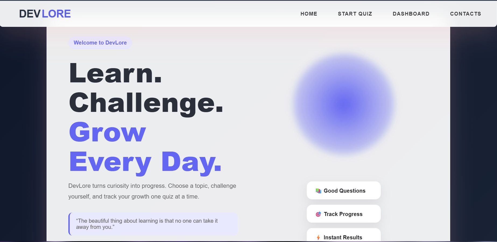
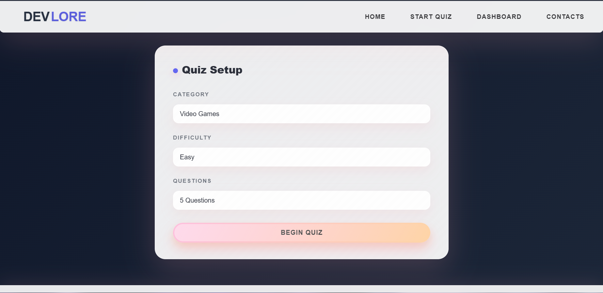
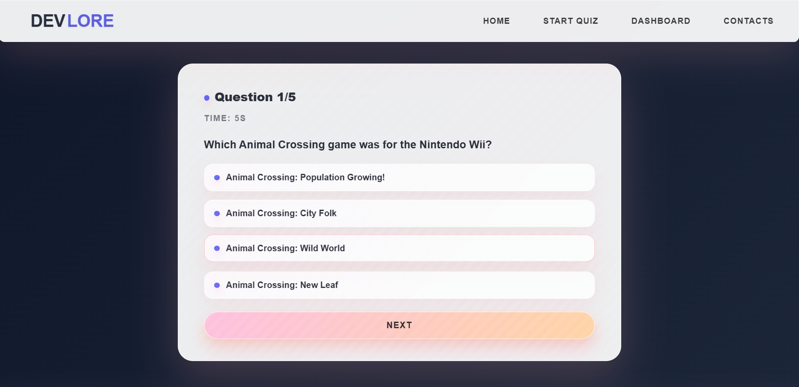
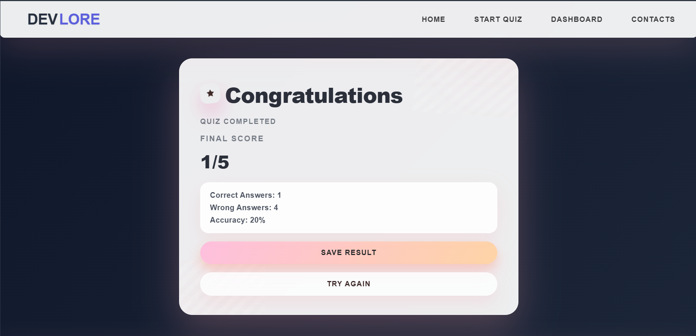
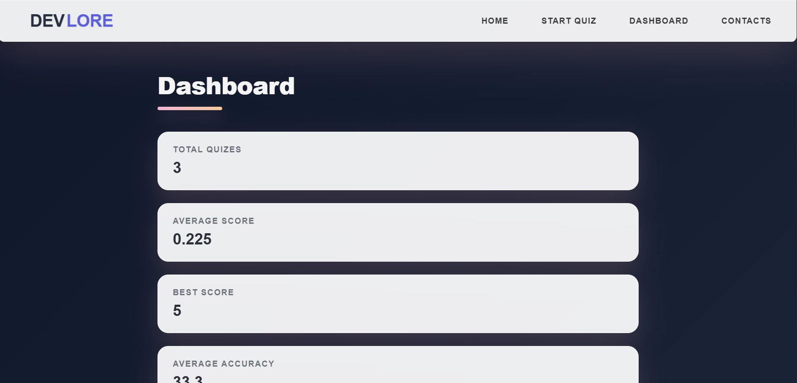

# 🌸 DevLore

A modern quiz platform built with **React**, **Vite**, **Axios**, and **Open Trivia DB API** that allows users to test their knowledge across multiple categories, track performance, and review past quiz attempts.

---

## ✨ Overview

DevLore is a dynamic quiz application designed to provide a smooth and engaging learning experience. Instead of relying on hardcoded questions, quizzes are fetched in real time from an external API, allowing users to explore a wide range of topics and difficulty levels.

The project focuses on practical React concepts including:

* Component-based architecture
* State management with Hooks
* API integration with Axios
* React Router navigation
* Local Storage persistence
* Dynamic rendering
* Performance tracking and analytics

---

## 🚀 Live Demo

🔗 **Website:** [(https://devlore-ebon.vercel.app/)]

🔗 **GitHub Repository:** [(https://github.com/pritesh-4/DevLore)]

---

## 📸 Screenshots

### Home Page



---

### Quiz Setup



---

### Quiz Interface



---

### Results Page



---

### Dashboard Analytics



---

## 🎯 Features

### Quiz Configuration

* Choose quiz category
* Select difficulty level
* Choose number of questions
* Dynamic question generation

### Quiz Experience

* Randomized answer positions
* Real-time timer
* Instant answer selection
* Score tracking

### Results

* Final score calculation
* Accuracy percentage
* Completion time tracking
* Save result functionality

### Dashboard

* Total quizzes completed
* Highest score achieved
* Total time spent
* Recent quiz activity
* Average performance analytics

### Data Persistence

* Quiz history stored using Local Storage
* Progress remains available after page refresh
* Saved results accessible from dashboard

---

## 🛠 Tech Stack

### Frontend

* React
* React Router DOM
* Vite
* CSS

### API

* Open Trivia DB API

### Storage

* Browser Local Storage

### HTTP Client

* Axios

---

## 📂 Project Structure

```text
src/
│
├── components/
│   ├── Navbar.jsx
│   ├── Footer.jsx
│   ├── Hero.jsx
│   └── Statsection.jsx
│   ├── StatCard.jsx
│   └── Activity.jsx
│
├── pages/
│   ├── Home.jsx
│   ├── QuizSetup.jsx
│   ├── Quiz.jsx
│   ├── Result.jsx
│   └── Dashboard,jsx
│
├── App.jsx
├── main.jsx
│
└── assets/
```

## ⚙️ Installation

Clone the repository:

```bash
git clone https://github.com/pritesh-4/DevLore.git
```

Navigate into the project:

```bash
cd DevLore
```

Install dependencies:

```bash
npm install
```

Start development server:

```bash
npm run dev
```

Build for production:

```bash
npm run build
```

---

## 📚 Concepts Practiced

This project helped me learn and apply:

* React Components
* Props
* useState
* useEffect
* Conditional Rendering
* Lists and Mapping
* API Fetching
* Axios
* React Router
* Local Storage
* State Management
* Dashboard Design
* Error Handling

---

## 🔮 Future Improvements

Planned features for future versions:

* User authentication
* Global leaderboard
* Dark mode
* User profiles
* Quiz categories analytics
* Difficulty-based statistics
* Backend database integration
* Achievement system
* Streak tracking

---

## 🧠 Challenges Faced

During development, several challenges were solved:

* Dynamic API integration
* Handling API failures
* Random answer shuffling
* Accurate score calculation
* Preserving quiz history
* Managing navigation state
* Preventing duplicate result saves

These challenges helped strengthen understanding of React application development and debugging.

---

## 👨‍💻 Author

**Pritesh Jena**

Built as a learning project to explore modern React development, API integration, and frontend application architecture.

---

## ⭐ Support

If you found this project interesting, consider giving the repository a star.
